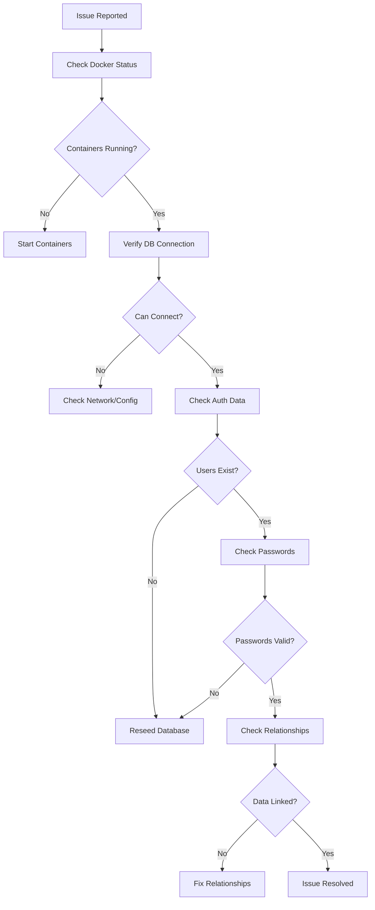

# Database Connection Troubleshooting Guide

This document summarizes the database connection setup, common issues, and troubleshooting steps for the Student Attendance System.

## System Overview

The application uses:
- **Database**: MySQL 8.0
- **Connection Library**: mysql2 with drizzle-orm
- **Environment**: Docker containers (db and app services)
- **Authentication**: bcrypt password hashing with session management

## Database Configuration

### Connection Parameters
```javascript
const connectionConfig = {
  host: process.env.DB_HOST || 'localhost',     // 'db' in Docker, 'localhost' for direct access
  port: parseInt(process.env.DB_PORT || '3306'),
  user: process.env.DB_USER || 'root',          // 'appuser' in Docker
  password: process.env.DB_PASSWORD || '',      // 'apppassword' in Docker
  database: process.env.DB_NAME || 'student_attendance',
  timezone: '+08:00',                           // Philippine timezone
  charset: 'utf8mb4_unicode_ci'
};
```

### Docker Environment
The database is accessible:
- **Internally** (within Docker network): `db:3306`
- **Externally** (from host machine): `localhost:3306`

## Common Issues & Solutions

### 1. Authentication Failures

**Symptoms**:
- "Invalid credentials" errors
- "Not authenticated" responses
- 401 HTTP status codes

**Root Causes**:
- Corrupted or improperly hashed passwords in database
- Missing user records
- Incorrect login credentials

**Solutions**:
1. Reseed database with proper bcrypt password hashes:
   ```bash
   docker exec -it attendance_app node reseed-db.js
   ```

2. Verify password hashes:
   ```bash
   docker exec attendance_db mysql -u appuser -papppassword student_attendance -e "SELECT id, email, password FROM users;"
   ```

3. Test authentication:
   ```bash
   curl -X POST http://localhost:3000/api/auth/login -H "Content-Type: application/json" -d '{"email":"prof.smith@ustp.edu.ph","password":"password123"}'
   ```

### 2. Database Connection Issues

**Symptoms**:
- "ECONNREFUSED" errors
- "Access denied" errors
- Application fails to start

**Root Causes**:
- Docker containers not running
- Incorrect connection parameters
- Network configuration issues

**Solutions**:
1. Check container status:
   ```bash
   docker ps
   ```

2. Start containers if not running:
   ```bash
   docker-compose up -d
   ```

3. Verify database connectivity:
   ```bash
   docker exec attendance_db mysql -u appuser -papppassword student_attendance -e "SHOW TABLES;"
   ```

### 3. Missing Data Relationships

**Symptoms**:
- Empty lists in UI
- "No data found" messages
- Incomplete dashboard information

**Root Causes**:
- Empty relationship tables (class_enrollments, attendance_records, etc.)
- Foreign key constraint issues

**Solutions**:
1. Check table counts:
   ```bash
   docker exec attendance_db mysql -u appuser -papppassword student_attendance -e "SELECT COUNT(*) as count FROM class_enrollments;"
   ```

2. Reseed database with complete data:
   ```bash
   docker exec -it attendance_app node reseed-db.js
   ```

## Diagnostic Tools

### Database Verification Script
Run from within the Docker container:
```bash
docker exec -it attendance_app node check-db.js
```

This script provides:
- Connection status
- Table counts
- Sample data verification
- Error diagnostics

### Direct Database Access
```bash
# Access MySQL directly
docker exec -it attendance_db mysql -u appuser -papppassword student_attendance

# Check specific tables
SELECT COUNT(*) FROM users;
SELECT COUNT(*) FROM students;
SELECT COUNT(*) FROM classes;
SELECT COUNT(*) FROM class_enrollments;
```

## Database Schema

### Key Tables
1. **users** - Authentication and user information
2. **students** - Student-specific data
3. **classes** - Course information
4. **class_enrollments** - Student-class relationships
5. **attendance_records** - Attendance tracking
6. **teacher_availability** - Teacher schedules

### Important Relationships
- users.id → students.user_id
- users.id → classes.teacher_id
- classes.id → class_enrollments.class_id
- students.id → class_enrollments.student_id

## Troubleshooting Workflow



## Prevention Best Practices

1. **Regular Verification**: Run check-db.js periodically
2. **Proper Seeding**: Always use the reseed script to ensure data integrity
3. **Environment Consistency**: Keep docker-compose.yml configurations synchronized
4. **Password Security**: Never commit plain text passwords to version control
5. **Backup Strategy**: Regular database backups for production environments

## Emergency Recovery

If the database becomes corrupted:

1. Stop containers:
   ```bash
   docker-compose down
   ```

2. Remove volumes (WARNING: This deletes all data):
   ```bash
   docker-compose down -v
   ```

3. Rebuild and restart:
   ```bash
   docker-compose up --build
   ```

4. Reseed database:
   ```bash
   docker exec -it attendance_app node reseed-db.js
   ```

## Contact Information

For persistent issues, contact the development team with:
- Error messages
- Docker logs: `docker logs attendance_app` and `docker logs attendance_db`
- Database verification output
- Steps to reproduce the issue

---

*Last Updated: September 27, 2025*
*Prepared by: JODIE*